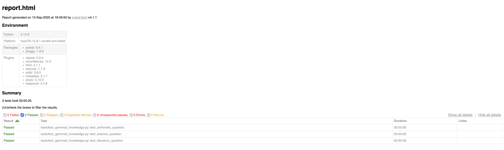

### Test Automation using deepeval and Pytest 

### Features:
- Test Automation using deepeval and Pytest using a locally running gemma3:1b model on Ollama which is a Local LLM Management Framework
- A simple automated test suite which verifies LLM output for some basic factual questions
- Used some base LLM evaluation metrics like `AnswerRelevancy` , `Bias` and `Toxicity`

### How to Run tests?
- Clone the project 
- Download and install Ollama tool and gemma3:1b https://ollama.com/library/gemma3 model
- Make sure your locall ollama instance is up and running the gemma3 model 
- Run either `pytest -s --html report.html` OR `deepeval test run ./`

### Example Pytest Report

### Example DeepEval Test Report

### References:
- https://deepeval.com/docs/getting-started
- https://github.com/ollama/ollama
